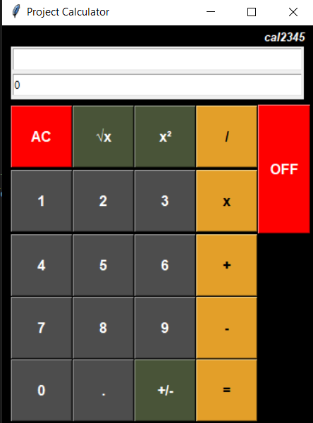

# Tkinter
Tkinter is the standard Python interface to the Tk GUI toolkit which provides tools for an easy and simple GUI creation. This is a good toolkit to start with for GUI design specially when you need some sort of simple GUI to show your work running in the backend. <https://docs.python.org/3/library/tkinter.html>

## Cannon_Game
This is a simple GUI development of the famous canon game using Tkinter package of python. The GUI interface created can select the Angle of the canon to shoot in a range of 0 to 90 degrees using a slider and select the Strength with which the ball is shot in a continuous scale from 0-200N slider. 
Goal is to select the correct combination of Strength and Angle such that the Canon Ball flies over the obstacle and land on the target place. The path of the canon ball is rendered on to the canvas. There is the option of taking air friction into consideration while the ball is moving. 
The script can be further developed to refresh at every attempt rather than drawing on the same canvas. 

## Simple Calculator design
Thsi is a simple calculator designed using Tkinter that is capable of performing general mathematical operation, i.e. addition, subtraction, division and multiplication. Further, it is capable of performing the square root function, power of 2 and +/- operations. This can be extended for a scientific calculator as well with extra functions. 

